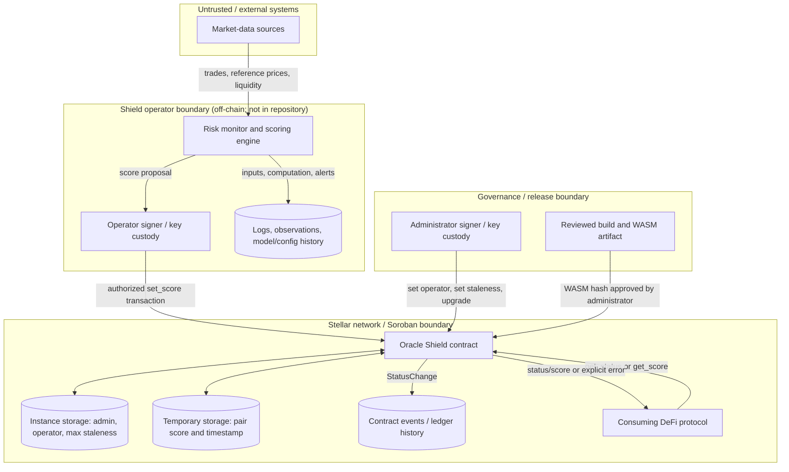

# Stellar Oracle Shield Threat Model

## Scope and assumptions

Stellar Oracle Shield is a risk-signal and circuit-breaker contract, not a price oracle. An off-chain monitor derives a health score from market data; the configured operator publishes that score for a `(base, quote)` pair. The Soroban contract stores the latest score and publication timestamp, converts the score to `Healthy`, `Degraded`, or `Unsafe`, and allows consuming DeFi protocols to decide how to react.

This model covers the contract in this repository, its deployment and upgrade path and the operator publication path. The off-chain monitor is shown because it is a security-critical dependency, although its implementation is outside this repository. Controls attributed to it below are therefore requirements, not claims about existing code.

Security objectives are:

- Only the configured operator can publish scores, and only the administrator can change security-critical configuration or upgrade the contract.
- A returned score/status is authentic, in range, associated with the requested ordered pair, and sufficiently recent.
- Consumers can distinguish healthy, degraded, unsafe, missing, and stale inputs and fail closed where appropriate.
- Administrative, operator, publication, and upgrade actions are attributable and observable.
- The service remains available within reasonable adversarial and upstream-failure conditions.

Primary assets are the administrator and operator signing keys, monitoring inputs and scoring logic, contract WASM and configuration, per-pair scores and timestamps, contract identity/network configuration and emitted events.

## 1. Dataflow diagram

Trust boundaries and important flows:

1. External data crosses into the off-chain monitor and must be treated as adversarial.
2. The operator signer converts an off-chain conclusion into an authenticated on-chain update.
3. The administrator can replace the operator, alter freshness policy, and replace all contract code; it is the highest-impact role.
4. Contract state and events inherit Stellar ledger integrity, but temporary entries have a finite lifetime and require lifecycle management.
5. A consumer crosses a separate integration boundary: Shield recommends a state, while the consumer implements the actual circuit breaker.

## 2. Threat table

| Threat | Issues |
|---|---|
| Spoofing | **Spoof.1** — Theft or misuse of the operator key lets an attacker publish arbitrary health scores for any pair. **Spoof.2** — Theft or misuse of the administrator key lets an attacker replace the operator, weaken freshness policy, or install malicious WASM. **Spoof.3** — A consumer can query the wrong contract ID, Stellar network, or look-alike asset address and believe the response came from the intended Shield/pair. **Spoof.4** — The off-chain monitor may accept a spoofed market-data as a legitimate source. |
| Tampering | **Tamper.1** — Manipulated, stale, selectively withheld, or low-liquidity source data can cause the monitor to compute an unsafe score as healthy. **Tamper.2** — Compromise or malfunction of the scoring process, its runtime dependencies, or its host can alter the calculated pair or score before an authorized set_score transaction is submitted. **Tamper.3** — A malicious or unreviewed upgrade can change authorization, score boundaries, storage layout, or freshness behavior. **Tamper.4** — Configuration changes can set `max_staleness` to an unsafe value (including zero or effectively unbounded) or assign an unintended operator. |
| Repudiation | **Repudiate.1** — An operator or administrator may deny publishing a score or changing configuration; the current contract emits only status-boundary changes and no events for every score/config/upgrade action. **Repudiate.2** — The off-chain system may be unable to reproduce why a score was generated |
| Information Disclosure | **Info.1** — Operator/admin seed phrases, signing material, CI credentials, or local Stellar CLI identities may leak through source control, logs, shell history, build artifacts, or compromised runners. **Info.2** — Public score updates and events reveal monitored pairs and health transitions, enabling adversaries to time attacks or infer risk policy. This is inherent to an on-chain public signal. |
| Denial of Service | **DoS.1** — Upstream data-source outages, rate limits, or network partitions stop fresh scores; after `max_staleness`, all protected actions may fail closed. **DoS.2** — Exhaustion of the operator account balance, fee spikes, sequence conflicts, or transaction flooding delays score publication. **DoS.3** — An administrator can accidentally or maliciously set an impractically short freshness window or an unusable operator, halting updates/consumption. **DoS.4** — Excessive pair cardinality or update frequency can exhaust monitor, signer, RPC, or budget capacity and crowd out critical pairs. |
| Elevation of Privilege | **Elevation.1** — A defect in authorization or an upgrade could allow a public caller to invoke operator/admin capabilities. **Elevation.2** — Compromise of the CI/release/deployment environment can turn code-contribution or runner access into control over an approved WASM hash or deployment identity. **Elevation.3** — A single administrator has unilateral authority to rotate the operator, change freshness, and upgrade code; compromise of that role becomes full protocol control. |

## 3. Threat answer table

Status values below use **Implemented** for controls visible in this repository, **Required** for controls that should be added or enforced operationally, and **Accepted** for deliberate residual risk.

| Threat | Answers / treatments | Status |
|---|---|---|
| Spoof.1 | **Spoof.1.R.1** — Keep `operator.require_auth()` on every score write and add regression tests for unauthorized callers. **Spoof.1.R.2** — Use a dedicated, least-privilege operator account. At minimum, store its key in a root- or service-account-owned file with mode 0600, outside application configuration, source control, backups, diagnostics, and CI; restrict host and process access and maintain a key-rotation procedure. For production or higher-value deployments, prefer an HSM, managed signer, or MPC-based signing system so the raw private key is not exposed to the scoring host. **Spoof.1.R.3** — Monitor for operator transactions that cannot be correlated with an authorized scoring job. Maintain an independently secured and funded replacement operator account, and regularly test a documented procedure for pausing publication, rotating the operator with set_operator_key, activating the replacement signer, and verifying recovery. | R.1 Implemented R.2 Partially implemented R.3 Required |
| Spoof.2 | **Spoof.2.R.1** — Preserve administrator authentication for configuration and upgrades. **Spoof.2.R.2** — Put administration behind multisig/contract-account governance with separate approvers, hardware-backed keys, and an emergency recovery procedure. **Spoof.2.R.3** — Alert on every administrator action and verify the expected signer and change ticket. | R.1 Implemented  R.2 Required R.3 Required |
| Spoof.3 | **Spoof.3.R.1** — Pin network passphrase, canonical Shield contract ID, expected `version()`, and canonical SAC addresses in each integration and deployment manifest. | Required |
| Spoof.4 | **Spoof.4.R.1** — Combine independent providers/venues and source classes; do not allow one endpoint identity to count as multiple independent observations. | Required |
| Tamper.1 | **Tamper.1.R.1** — Use robust multi-source aggregation, minimum liquidity/source-count rules, deviation and rate-of-change bounds, stale-input rejection, and asset-specific thresholds. **Tamper.1.R.2** — Fail safe (`Unsafe` or no publication) when quorum/confidence is insufficient; never reuse a last-known-good score without clearly bounded age. **Tamper.1.R.3** — Continuously compare sources and alert/quarantine outliers; adversarially test thin-market, flash-manipulation, and coordinated-source scenarios. | Required (off-chain) |
| Tamper.2 | **Tamper.2.R.1** — Run the scoring process under a dedicated, least-privilege OS account on a hardened host. Restrict deployment and filesystem access, pin and verify dependencies, protect the operator key, and ensure only reviewed builds can run. | Required |
| Tamper.3 | **Tamper.3.R.1** — Require reproducible builds, locked dependencies, tests/audit, and multiple approvals for the exact WASM hash before upgrade. **Tamper.3.R.3** — Prefer timelocked/multisig upgrades with monitoring and a rehearsed recovery release. | Required |
| Tamper.4 | **Tamper.4.R.1** — Emit an event containing the previous and new values for every change. **Tamper.4.R.2** — Validate a new operator is intentional and usable, require two-step rotation or governance approval, and exercise a post-change publication check. | Required |
| Repudiate.1 | **Repudiate.1.R.1** — Emit events for every score publication (including score, pair, timestamp/policy version), operator rotation, freshness change, and upgrade hash; retain transaction and ledger identifiers in an indexed audit log. **Repudiate.1.R.2** — The existing `StatusChange` event remains useful but is insufficient alone because same-status score updates leave no contract event. | Partial; enhancement Required |
| Repudiate.2 | **Repudiate.2.R.1** — Store immutable or append-only records of normalized source observations, source timestamps, scoring code/config/model version, output, signer identity, and submission transaction hash. | Required |
| Info.1 | **Info.1.R.1** — Use hardware-backed or managed signing, secret scanning, protected environments, least-privilege CI, masked logs, and documented rotation after suspected exposure. **Info.1.R.2** — Treat repository helper arguments and shell history as non-secret; never pass raw seeds through them. | Required |
| Info.2 | **Info.2.R.1** — Accept that on-chain state/events are public; do not encode secrets in scores, pair metadata, or events. | Accepted with mitigation |
| DoS.1 | **DoS.1.R.1** — Use diverse providers, timeouts, circuit breakers, cached observations within strict age bounds, health checks, and alerting. | Required |
| DoS.2 | **DoS.2.R.1** — Monitor/fund the operator account, serialize sequence-number use or use channel accounts, set fee policy, retry idempotently, and alert on publication latency. | Required |
| DoS.3 | **DoS.3.R.1** — Enforce two-person review, preflight simulation, config-change events, and alerts. | Required |
| DoS.4 | **DoS.4.R.1** — Cap update frequency, prioritize critical pairs, batch/queue off-chain work, apply resource budgets, and load-test worst-case cardinality. | Required |
| Elevation.1 | **Elevation.1.R.1** — Maintain negative authorization tests for every privileged function, including after every upgrade; fuzz contract inputs and review all new entry points. **Elevation.1.R.2** — Keep privileged logic small and centralize role checks. | Auth checks/tests Partial; ongoing Required |
| Elevation.2 | **Elevation.2.R.1** — Protect branches/tags, pin actions and dependencies, generate provenance/SBOM, isolate release runners, prohibit untrusted PR code from signing/deploying, and require human approval of the exact artifact hash. **Elevation.2.R.2** — Separate build, upload, and admin-approval identities. | Partially implemented |
| Elevation.3 | **Elevation.3.R.1** — Replace a single administrator key with threshold governance; use timelocks for routine changes and a narrowly scoped, transparent emergency path. **Elevation.3.R.2** — Consider separating upgrader and configuration-manager roles in a future contract version. | Required |

## References

- [Stellar threat-modeling guide](https://developers.stellar.org/docs/build/security-docs/threat-modeling/threat-modeling-how-to)
- [SDF STRIDE template](https://developers.stellar.org/docs/build/security-docs/threat-modeling/STRIDE-template)
